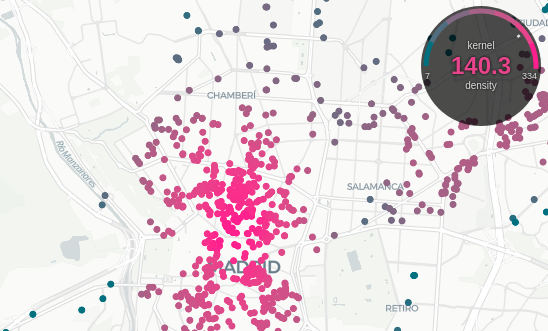

# Dynamic gauge legend for MapLibre



This simple control adds a dynamic legend component to a [MapLibre GL](https://github.com/MapLibre/maplibre-gl-js) map, where, for a given layer and property, the average value of this property for the features currently rendered is displayed and a tick points to its position in the gauge scale.

It's based in the gauge I implemented in  the app [Distanciamiento peatonal in Madrid](https://distanciamiento.inspide.com/) (a map where the width of the sidewalks in Madrid are evaluated in terms of keeping the required social distancing), but made into a proper parametric control.

## How to

It has no dependencies, but if you want to use it as an UMD bundle, you need to

```bash
yarn install
yarn build
```

You will find the deliverables in the `/dist` folder. Just reference the CSS in your html

```html
 <link rel="stylesheet" type="text/css" href="dist/gaugelegend.css" />
```
If you want to use the global `GaugeLegend` object instead of importing the module, then you need to add the script too

```html
 <script src="dist/gaugelegend.js"></script>
```

Then, in your script

```javascript
const map = new maplibre.Map({ ... });

map.on('load', function () {
    map.addLayer({
        id: 'my_layer',
        ...
    });
    const gauge = new GaugeLegend({        
        layer: 'my_layer',
        property: 'my_property',
        colors: ["#007080", "#546e82", "#7f6984", "#a16287", "#c25689", "#e0448b", "#ff1d8e"],
        breaks: [7,17,32,57,129,253,334]
    });
    map.addControl(gauge, 'top-right');
})

```

And Ta-da!


Check the live example [here]()

## Parameters

| Param | Datatype |  Description | Default |
|---|---|---|---|
| layer | string | The ID of the layer to be observed |  |
| property | string | The property that will be observed |  |
| colors | string[ ] | Array of HEX colors to be used in the legend. Should match the ones used to style the layer |  |
| breaks | number[ ] | Array of breaks of the classification of the selected property. Must have the same size as `colors` |  |
| theme | enum['dark', 'light'] | Avaliable themes | 'dark' |
| size | string | Max diameter of the control in [CSS units](https://www.w3schools.com/cssref/css_units.asp). It tries to grow up to 20% of the height of the viewport, limited by this value | '100px' |
| unit | string | Unit symbol to be added to the displayed value | '' |
| text1 | string | Upper text | '' |
| text2 | string | Bottom text | '' |
| trigger | enum['idle', 'moveend'] | Map event that fires the control update. It defaults to `idle` as it's safer when the tiles are heavy or the number of rendered features is high. `moveend` gives a smoother experience but might give false results | 'idle' |

## Custom theming
Custom themes can be used by adding the needed classes in your CSS:

```css
.gauge-mycustomtheme {
    /* Using semitransparent background
    lightens the visual weight of the control */
    background: my_background_color;
}
.text-mycustomtheme {
    color: my_font_color;
    /* Adding a halo to improve readability 
    if semitransparent background was used */
    text-shadow: 0 0 3px my_background_color_no_transparency;
}
```

The tick won't be themed as its color doesn't rely on CSS, but this issue can be overrided:

```javascript
gauge._tick.setAttribute('stroke', my_tick_color);
```

## To Do

* Change CSS classes to `maplibre` namespace when available. 

## Notes

Example favicon by [Nick Roach](https://www.elegantthemes.com/)